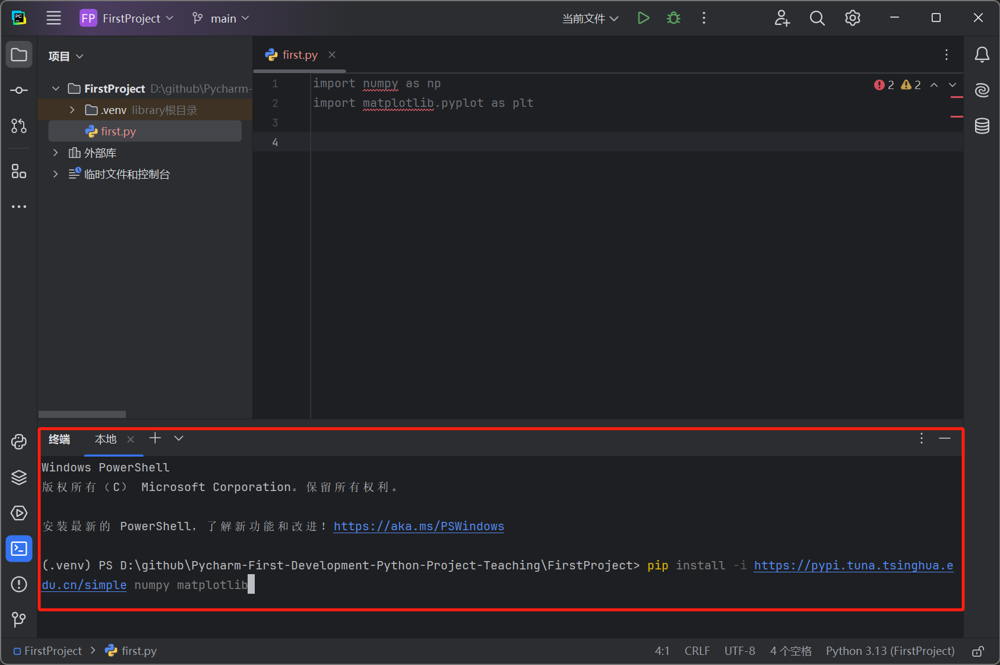

# 介绍

手把手从0开始教你使用PyCharm开发本地和远程Python项目（使用虚拟环境），新手必看！

拒绝下载Anaconda，繁重，占用空间，环境管理混乱。

使用PyCharm的虚拟环境可以一个项目一个独立的环境，需要什么包就下载什么包，互不干扰，特别是包的版本问题。

注意，都是在Windows平台，Linux平台可以在Windows平台远程开发即可，尽管提供了Linux版本（见后）。


如果对你有帮助，可以点个Star鼓励下！

# 一、Python下载安装


进入Python官网的下载区，https://www.python.org/downloads/，目前最新是3.13.0版本


双击下载下来的 python-3.13.0-amd64.exe


这里默认下一步next即可（注意pip一定要勾选，因为要使用它下载别的包）


点击Browse修改Python安装位置，这里为 D:\Python，注意记住（能找到）这个位置，然后点击 Install，等待......


出现此页面，successful，点击close，Python安装完毕。


# 二、PyCharm下载安装

PyCharm 是由 JetBrains 开发的一款功能强大的 Python 集成开发环境（IDE）。提供了丰富的工具和功能。

PyCharm 是一个非常适合 Python 开发者的 IDE，无论是初学者还是经验丰富的开发者都能从中受益。

强烈推荐 PyCharm 作为 Python 开发首选 IDE ！！！


进入官网，https://www.jetbrains.com.cn/pycharm/download/?section=windows


注意，请下载专业版（Professional），选择Windows版本，下面也有社区版，是免费的，但是不支持远程开发，为此这里选择专业版，最新版本 2024.2.4

双击下载下来的 pycharm-professional-2024.2.4.exe


下一步


下一步


下一步


安装，等待......


完成


# 三、创建第一个项目并配置环境

## Windows本地项目开发

双击桌面Pycharm打开

会提示你激活，激活的办法这里不说明，请支持正版！！！，激活后先退出


开始创建项目，第一种方法，你可以进入Pycharm，左上角，文件，新建项目...

我选择第二种方法，你可以在某个位置新创建一个文件夹（假设为 FirstProject）作为项目文件夹，右击新创建的项目文件夹 FirstProject，显示更多选项（Win11才需要），Open Folder as PyCharm Project

注意，第一次使用Pycharm可能是英语界面，切换为中文界面


点击左上角主菜单


点击 File—Settings...——Plugins，可以搜索 Chinese (Simplified) Language Pack / 中文语言包，如果已经预先安装了，Enable即可，如果没有，先安装一下，最后重启 IDE 即可。


再打开项目


关键！！！点击左下角配置解释器（没有解释器PyCharm就是个编辑器，无法执行Python程序）


选择 添加新的解释器——添加本地解释器...


选择 Virtualenv 环境——新建，填写位置和基础解释器，位置是虚拟环境（例如各种包）存放的位置，默认是在你当前项目文件夹下，基础解释器，选择之前我们下载Python存放的文件夹的python.exe，默认也是可以给你自动识别出来的，基本这两项都不用自己填，注意一些就行。

点击确定，左下角变为 Python 3.13 (FirstProject)，解释器配置成功，项目文件夹出现 .venv 文件夹存放包（即虚拟环境）


下面做一个项目，正弦波可视化，需要安装 `numpy` 和 `matplotlib` 包。

我们在项目文件夹下新建一个Python文件，右击FirstProject——新建——Python文件，命名为first，我们写入两句导包代码


发现 numpy、matplotlib 下面是红色波浪线，原因是没有下载此包（或者没找到包）

下面开始安装包，点击左下角终端按钮


光标闪烁出通过以下命令安装它们

```shell
pip install numpy
pip install matplotlib
```

注意，可以切换成国内的清华镜像源（也有其他的镜像源），速度更快，不切换可能速度非常墨迹，半天下不动

```shell
pip install -i https://pypi.tuna.tsinghua.edu.cn/simple numpy
pip install -i https://pypi.tuna.tsinghua.edu.cn/simple matplotlib
```

或者一起安装

```shell
pip install numpy matplotlib
pip install -i https://pypi.tuna.tsinghua.edu.cn/simple numpy matplotlib
```



然后你发现波浪线消失，说明包成功下载并导入，在 .venv 文件夹你可以发现 numpy、matplotlib 文件夹生成在这里了，.venv 文件夹就是来管理各种包的。

完成剩余的代码

```python
import numpy as np
import matplotlib.pyplot as plt

# 设置参数
frequency = 1  # 频率
sampling_rate = 100  # 采样率
duration = 2  # 持续时间（秒）

# 生成时间轴
t = np.linspace(0, duration, int(sampling_rate * duration), endpoint=False)

# 生成正弦波
y = np.sin(2 * np.pi * frequency * t)

# 绘制图形
plt.figure(figsize=(10, 4))
plt.plot(t, y, label='Sine Wave', color='b')
plt.title('Sine Wave')
plt.xlabel('Time [s]')
plt.ylabel('Amplitude')
plt.axhline(0, color='black', lw=0.5, ls='--')
plt.axvline(0, color='black', lw=0.5, ls='--')
plt.grid()
plt.legend()
plt.show()
```

点击右上角绿色的▷按钮，运行


成功


## Linux远程项目开发

